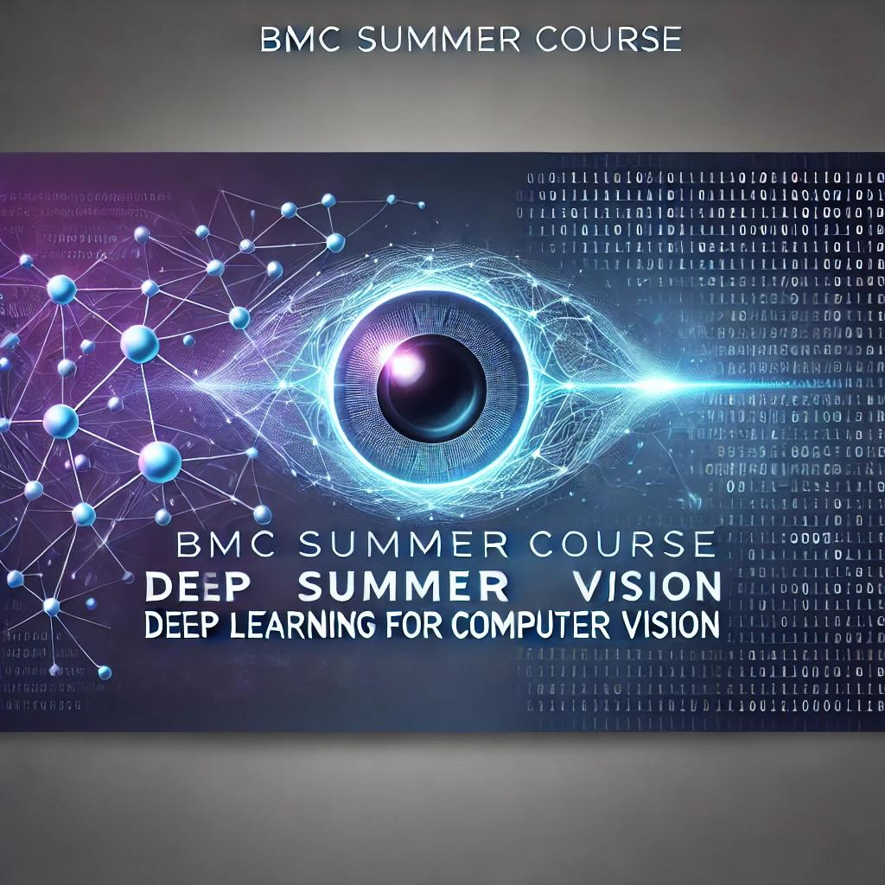

## Deep Learning for Computer Vision Course
Welcome to the Deep Learning for Computer Vision course, crafted and delivered during the Summer of 2024 at Belfast Metropolitan College. This intensive program is designed for individuals eager to explore the dynamic fields of deep learning and computer vision, providing both foundational knowledge and hands-on experience.

### Who Should Enroll?
- **Beginners**: Individuals new to machine learning and computer vision seeking a solid starting point.
- **Developers and Engineers**: Professionals aiming to enhance their skill set with advanced AI-driven image and video analysis techniques.
- **Data Scientists**: Practitioners looking to incorporate sophisticated computer vision methodologies into their data projects.
- **Researchers and Academics**: Scholars pursuing further studies or innovative research in related domains.

### Course Objectives

- **Foundational Understanding**: Grasp the essential principles of deep learning and their application in computer vision.
- **Practical Skills**: Develop hands-on expertise by building and implementing neural networks, convolutional neural networks (CNNs), and advanced models using frameworks like TensorFlow and PyTorch.
- **Advanced Techniques**: Explore state-of-the-art architectures such as ResNet, GANs, and object detection models like YOLO and Faster R-CNN.
- **Project Development**: Apply learned concepts through mini-projects, culminating in real-world applications and collaborative presentations.

### What You'll Learn
Over the span of four days, the course encompasses a comprehensive curriculum that includes:

- **Deep Learning Fundamentals**: Introduction to neural networks, activation functions, and the evolution of deep learning in computer vision.
- **Convolutional Neural Networks (CNNs)**: In-depth exploration of CNN architectures, spatial hierarchies, and practical implementation techniques.
- **Advanced Architectures and Object Detection**: Study of cutting-edge models and methodologies for detecting and classifying objects within images.
- **Transfer Learning and Fine-Tuning**: Leveraging pre-trained models to efficiently tackle new tasks and datasets.
- **Image Segmentation and Recurrent Networks**: Techniques for dividing images into meaningful segments and handling sequential data with RNNs, LSTMs, and GRUs.
- **Generative Adversarial Networks (GANs)**: Understanding and applying GANs for creative image generation, data augmentation, and style transfer.
- **Hands-On Projects**: Collaborative mini-projects to reinforce learning and demonstrate practical skills in real-world scenarios.

### Course Structure
The course is structured into four days, each dedicated to specific aspects of deep learning and computer vision. Each day combines theoretical lectures with practical hands-on sessions to ensure a balanced and engaging learning experience.

### Day 1: Introduction to Deep Learning and Computer Vision Basics

**10:00 AM - 11:00 AM: Introduction to Deep Learning**
- Overview of Deep Learning: Key concepts and history.
- How Deep Learning has revolutionised Computer Vision.
- Introduction to Neural Networks: Layers, neurons, activation functions.

**11:00 AM - 12:00 PM: Computer Vision Fundamentals**
- Image basics: Pixels, channels, and image representation in computers.
- Common image processing techniques: Filtering, edge detection, image transformations.
- Introduction to Convolutional Neural Networks (CNNs): The architecture and intuition behind CNNs.

**12:00 PM - 1:00 PM: Hands-On Session 1**
- Build a simple neural network using TensorFlow/PyTorch.
- Implement basic image processing tasks using OpenCV.
- First practical: Implement a basic CNN for image classification (e.g., MNIST dataset).

**1:00 PM - 2:00 PM: Lunch Break**

**2:00 PM - 3:00 PM: Deep Dive into CNNs**
- Detailed explanation of convolutional layers, pooling layers, and fully connected layers.
- Understanding how CNNs capture spatial hierarchies in images.
- Introduction to key CNN architectures (LeNet, AlexNet, VGG).

**3:00 PM - 4:00 PM: Hands-On Session 2**
- Practical implementation of CNN architecture on a more complex dataset (e.g., CIFAR-10).
- Visualisation of learned features using tools like TensorBoard.

### Day 2: Advanced CNN Architectures, Object Detection, and Transfer Learning

**10:00 AM - 11:00 AM: Advanced CNN Architectures**
- Introduction to more complex architectures: ResNet, Inception, DenseNet.
- Discuss the evolution and innovation in CNN architectures.

**11:00 AM - 12:00 PM: Object Detection Techniques**
- Overview of Object Detection: Difference between classification and detection.
- Introduction to key object detection models: YOLO, SSD, Faster R-CNN.
- Understanding the Intersection over Union (IoU) and mAP metrics.

**12:00 PM - 1:00 PM: Hands-On Session 3**
- Implement an object detection model using a pre-trained YOLO/SSD model.
- Fine-tune the model on a small custom object detection dataset.

**1:00 PM - 2:00 PM: Lunch Break**

**2:00 PM - 3:00 PM: Transfer Learning and Fine-Tuning**
- Concept of Transfer Learning: Why and how to use pre-trained models.
- Fine-tuning strategies for adapting pre-trained models to new tasks.
- Hands-on demonstration: Transfer Learning with a pre-trained model on a new dataset.

**3:00 PM - 4:00 PM: Hands-On Session 4**
- Implement Transfer Learning with a popular pre-trained model (e.g., ResNet50) on a custom dataset.
- Experiment with fine-tuning different layers and observe the impact on performance.

### Day 3: Image Segmentation, RNNs/LSTMs/GRUs, and Generative Models (GANs)

**10:00 AM - 11:00 AM: Image Segmentation Techniques**
- Introduction to Image Segmentation: Semantic vs. Instance Segmentation.
- Overview of key segmentation models: U-Net, Mask R-CNN.
- Applications of segmentation in real-world scenarios.

**11:00 AM - 12:00 PM: Hands-On Session 5**
- Implement a basic U-Net for image segmentation on a medical image dataset.
- Experiment with segmentation tasks using different architectures.

**12:00 PM - 1:00 PM: Introduction to RNNs, LSTMs, and GRUs**
- Understanding sequential data and the need for RNNs in Computer Vision tasks.
- Basic architecture of RNNs and their limitations (vanishing/exploding gradients).
- Overview of LSTMs and GRUs, with applications in Computer Vision such as Image Captioning and Video Analysis.

**1:00 PM - 2:00 PM: Lunch Break**

**2:00 PM - 3:00 PM: Hands-On Session 6**
- Implement a simple LSTM/GRU model for image captioning or video classification.
- Explore the use of RNNs in conjunction with CNNs for video-related tasks.

**3:00 PM - 4:00 PM: Introduction to Generative Adversarial Networks (GANs)**
- Overview of GANs: Architecture, training process, and challenges.
- Applications of GANs in Computer Vision: Image generation, data augmentation, style transfer.

### Day 4: Advanced GANs, Revision, and Mini Project

**10:00 AM - 11:00 AM: Advanced Applications of GANs**
- Deep dive into GAN architectures: DCGAN, Conditional GANs, CycleGAN.
- Discussion on challenges in training GANs (e.g., mode collapse, instability).
- Exploration of creative applications like StyleGAN and image-to-image translation.

**11:00 AM - 12:00 PM: Hands-On Session 7**
- Implement a DCGAN or CycleGAN on a simple image dataset.
- Experiment with image-to-image translation or style transfer tasks.

**12:00 PM - 1:00 PM: Revision Session**
- Recap key concepts covered in the previous days, focusing on Object Detection, Segmentation, and GANs.
- Quick quizzes and short exercises to reinforce learning.
- Open Q&A to clarify any doubts or revisit challenging topics.

**1:00 PM - 2:00 PM: Lunch Break**

**2:00 PM - 3:00 PM: Mini Project Implementation**
- Group students into small teams to work on a mini-project.
- Project options could include:
  - Implementing an object detection pipeline.
  - Designing a GAN for a creative image generation task.
  - Developing a CNN-RNN model for video classification or image captioning.
  - Building a segmentation model for a specific dataset.
- Instructors provide guidance and support as needed.

**3:00 PM - 4:00 PM: Project Presentations and Feedback**
- Each team presents their mini-project, including their approach, results, and challenges faced.
- Provide constructive feedback on each project.
- Wrap-up session: Discuss next steps for students who want to dive deeper into Computer Vision.
